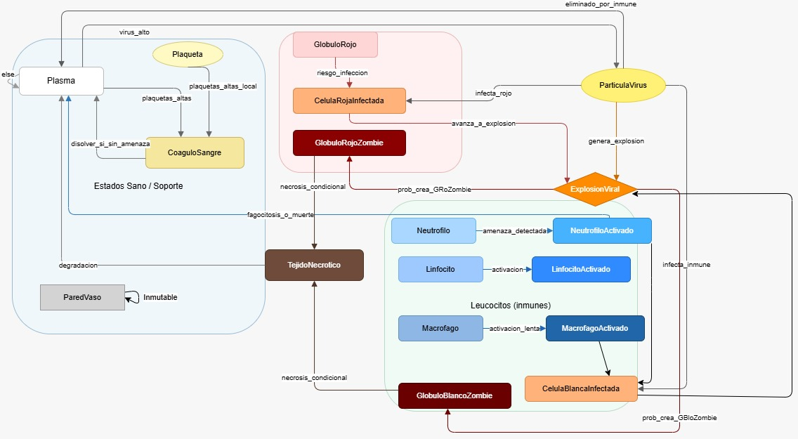

# 🧬 Simulador de Infección Zombie en Torrente Sanguíneo -Autómata Celular

- El presente repositorio recopila variedad de archivos en relación con el proyecto final de la asignatura Autómatas y Lenguajes Formales dictada por el docente Luis Guayacán en 2025-2.

## Descripción General.

Este proyecto es un autómata celualr que pretende simular la propagación de una infección zombie a nivel sanguíneo. El sistema modela el comportamiento del torrente sanguíneo humano durante una infección viral agresiva, visualizando la lucha entre el sistema inmune y un patógeno zombificante.

En su elaboración, la simulación utiliza una grilla donde cada célula representa un componente sanguíneo que evoluciona según reglas probabilísticas inspiradas en procesos biológicos reales.

---

## Objetivos del Proyecto.

- Observar propagación viral en el sistema sanguíneo.
- Generar una aproximación de la respuesta del sistema inmunitario y sus mecanismos de defensa.
- Visualizar la zombificación progresiva del organismo.

# Automata Celular: Comportamiento de Virus en el cuerpo humano

**Manejo de aproximación al comportamiento de un diagrama de estados.**

- La anterior imagen es el diagrama de estados de nuestra autómata celular
